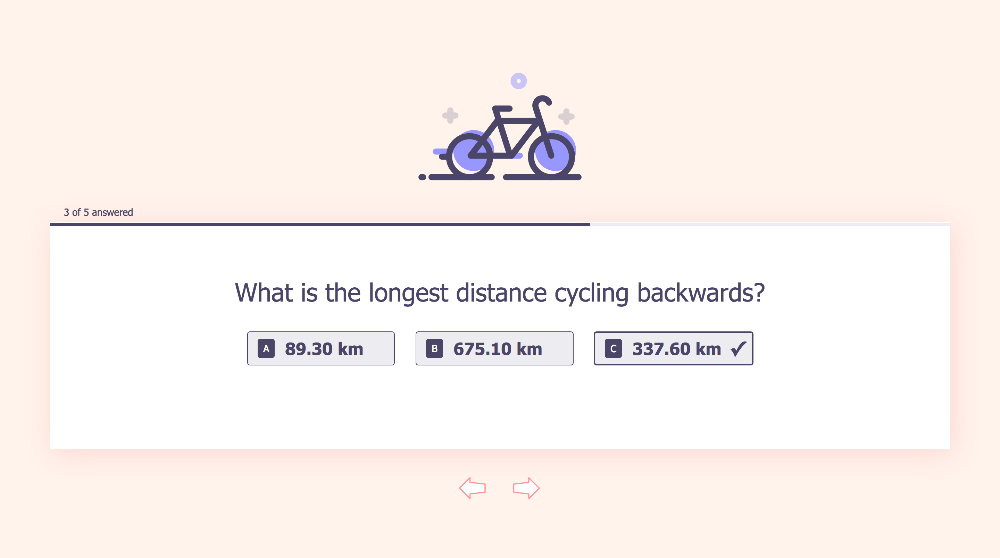
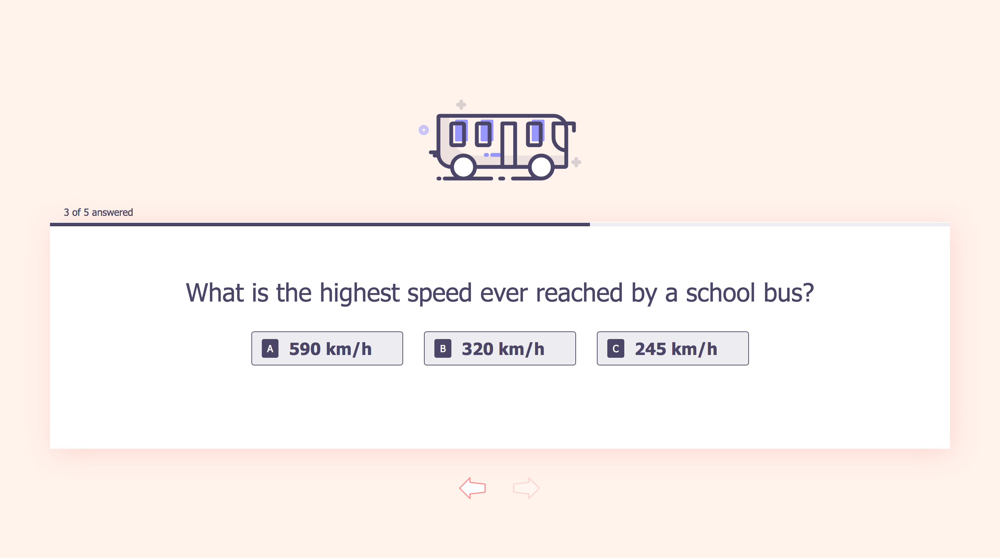
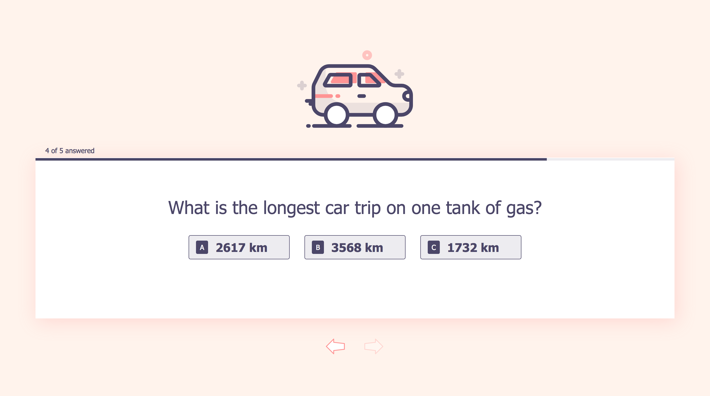
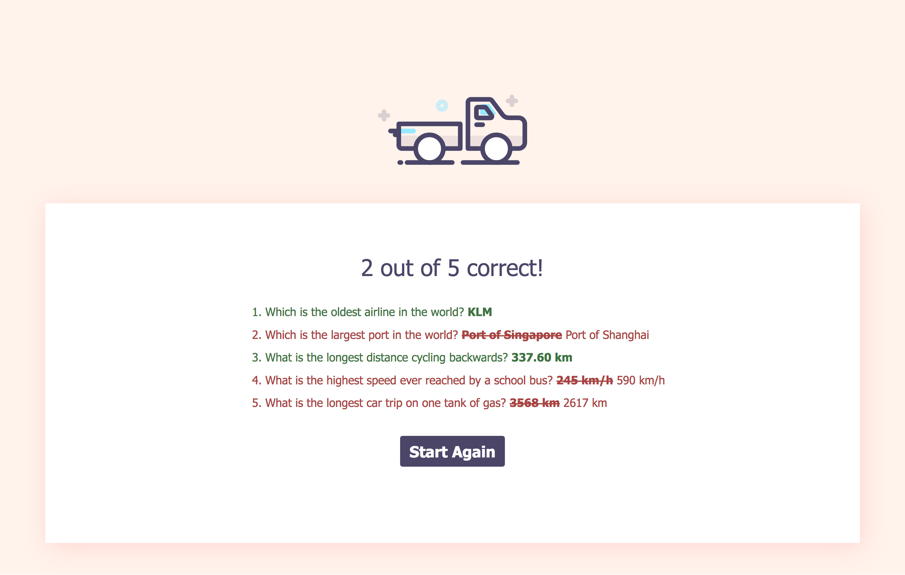

# ABC Quiz With React

In this project, we build an interactive ABC Quiz with React.

This quiz consists of 5 questions. User is presented 3 possible choices to select one as the only answer. Once an answer is selected, the button will flash a few times and a tick mark will appear on the right side of the button to indicate your selection. Next, current question screen will fade out and next question screen will fade in. At this point, progress will also be updated. This process of answer selection and moving on to next question by user is repeated until the final question is answered.

You will be presented a screen showing your answers for each question and a submit button below. Submission of your answers will proceed to check your answer selections to the right one.

Rest assured that anytime you select your answers, you can still navigate to previous questions to change your answers by using left and right controls located at the bottom of the quiz. Whenever you are ready, submit to check your answers.

The result screen will show you total of correct answers you got out of 5 questions. The result screen also shows you which question you answer correctly (green) and incorrectly (red) characterized by the text color. Correct answer(s) are shown at right side for the questions answered incorrectly. Finally, you can start over the quiz by hitting 'Start Again' button.

[View demo site here.](https://edwinchen85.github.io/abc_quiz_with_react/)

#### Question 1 Screen

#### Question 2 Screen

#### Question 3 Screen

#### Question 4 Screen

#### Question 5 Screen

#### Your Answer Screen

#### Result Screen

